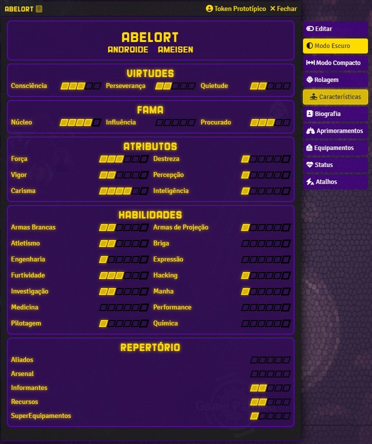
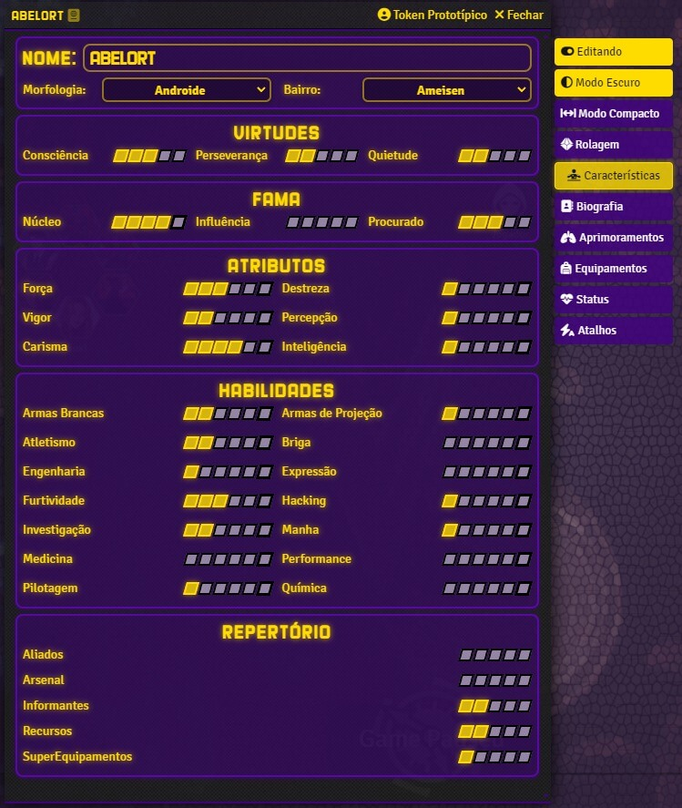
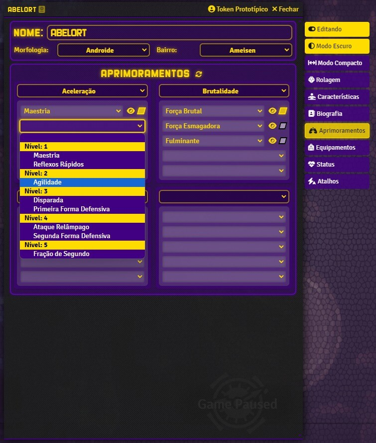
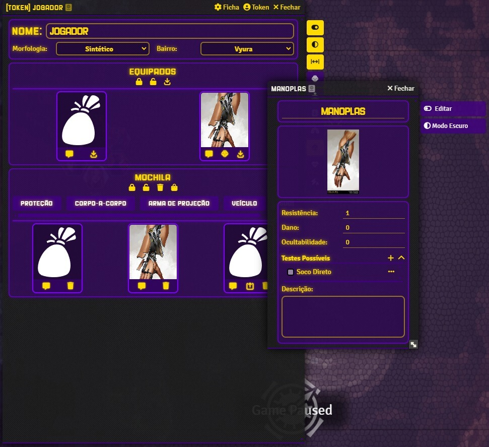
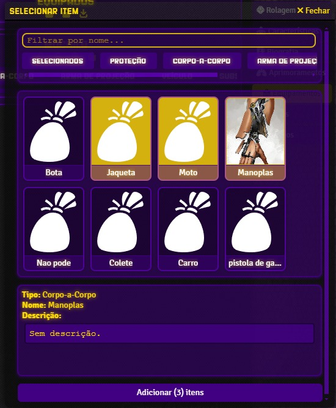
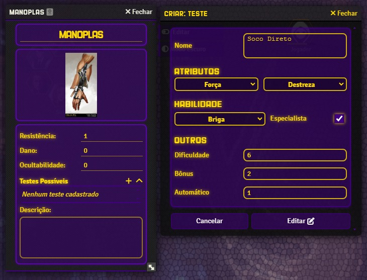
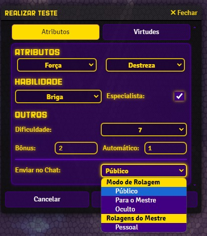
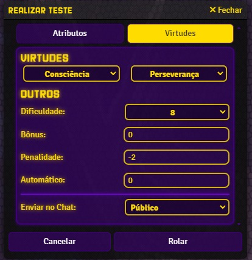

# Setor 0 RPG para o Foundry VTT
[🌐 Site oficial do Setor 0](https://setor0rpg.com.br)


---

Este é o sistema oficial de RPG **Setor 0**, totalmente integrado ao **Foundry VTT**, oferecendo suporte nativo para criação de personagens, rolagens personalizadas, efeitos automatizados e muito mais.

> ⚠️ **Aviso**: Este sistema está atualmente em fase **Alpha**, e pode conter bugs ou funcionalidades incompletas.

## 🧩 Instalação

1. Baixe ou clone este repositório.
2. Mova a pasta para o diretório `Data/systems` do seu Foundry VTT.
3. Reinicie o Foundry e ative o sistema ao criar um novo mundo.
> 🚧 Ainda será disponibilizado um manifesto para instalação direta via URL.

## Utilizando com seus jogadores
Caso você não possua um servidor para hospedar o Foundry e compartilhar o link, você pode criar um `QuickTunnel` com o `CloudFlare`. Da seguinte maneira:

1. Baixe e instale o [cloudFlarered](https://developers.cloudflare.com/cloudflare-one/connections/connect-networks/downloads/)
2. Execute o código no CMD
```console
cloudflared tunnel --url http://localhost:30000
```
3. Pegue o link que foi apresentado no console e compartilhe.

## Legenda de ícones
```
🧩 Instalação
🧬 Funcionalidades
🎨 Interfaces de Usuário
📜 Licença
🤝 Contribuindo
✅ Pronto
⚠️ Aviso
🛠️ Em desenvolvimento
🚧 Planejado
```

## 🧬 Funcionalidades
<details>
  <summary>Idiomas suportados</summary>
  
  ```
  ✅ Português
  🚧 English
  ```
</details>

### Personagem
* 🚧 Bônus de Nível 6.
* ✅ Aprimoramentos com efeitos passivos e ativos.
* ✅ Sistema de inventário com mochila e itens equipados.
* ✅ Atalhos customizados por Personagem.
* 🚧 Transacionar itens entre personagens.
* 🚧 Importar personagem do site.
* 🚧 Calculo de XP e pontos utilizados.

### Sistemas
* ✅ Aprimoramentos.
* ✅ Traços Bons e Ruins.
* ✅ Inventário.
* ✅ Atalhos.
* ✅ Aliados e Informantes.

### Efeitos
* ✅ Efeitos específicos do Setor 0.
* ✅ Efeitos ativos baseado em Aprimoramentos.
* 🛠️ Efeitos ativos baseado em Traços.
* 🛠️ Efeitos ativos baseado em Equipamentos.
* ✅ Efeitos que são ativados durante um combate são desativados automaticamente ao final dele.

### Equipamentos
* ✅ Ficha.
* ✅ SuperEquipamentos.
* ✅ Rolagem pelo Equipamento.
* ✅ Rolagem dividida pelo Equipamento.
* ✅ Atalhos customizados por Equipamento.

### Personagens Não Jogáveis (PNJ)
* ✅ Ficha.
* ✅ Rolagem.
* ✅ Converter PJ para PNJ.

### Rolagens
* ✅ Rolagem totalmente customizada.
* ✅ Rolagem simplificada (Personagens Não Jogáveis).
* ✅ Teste com Rolagem Dividida.
* ✅ Atributos + Habilidade.
* ✅ Virtudes.
* ✅ Sobrecarga.
* ✅ Vida.
* ✅ Iniciativa.
* ✅ Perseverança pela mensagem do chat.
* ✅ Rolagem com Crítico variável.
* ✅ Rolagens considerando as penalidades e todos os bônus.

### Macros
O Setor 0 conta com um sistema de Macros pré-definidos para novos jogadores. Todo novo jogador recebe em sua Hotbar 3 macros iniciais, dois deles servem para abrir a ficha do Personagem em uma página específica, como a da mochila ou dos atalhos, o terceiro serve para realizar um teste de Sobrecarga, que é comum no sistema.

* ✅ Macros iniciais pré-configurados para novos jogadores.
* ✅ Compendium de Macros para Mestres e Jogadores.
* ✅ Funções padrão para criar novos Macros

<details>
  <summary>Métodos Globais para Macros</summary>
  
  ```mjs
  global.MacroMethods {
     overload: async (actor) => {
        // recebe um Actor e executa uma rolagem de Sobrecarga (enviando no chat)
     },
     customs: {
        rollable: async (actor, rollTestId) => {
            // recebe um Actor e um id referente a um RollTestData e realiza a rolagem (enviando no chat)
        }
     }
  }
  ```
</details>

<details>
  <summary>Como usar os métodos</summary>
  
  - Ao criar o commando do macro, utilize o seguinte código:
  
  ```mjs
  global.MacroMethods.rollable(actor, rollId);
  ```

  - Um Exemplo de uso real:
  
  ```js
  const selectedToken = canvas.tokens.controlled[0];
  if (!selectedToken) {
    ui.notifications.warn("Selecione um token primeiro.");
    return;
  }
  
  const actor = selectedToken.actor;
  if(!actor?.sheet.canRollOrEdit) {
    ui.notifications.warn("Sem permissão para esse personagem.");
    return;
  }
  
  await globalThis.MacroMethods.customs.rollable({actor, id: "642750db952e4aed87227edcf74bc05e"});
  ```
</details>

## 🎨 Interfaces de Usuário
<details>

- ✅ Tema escuro para fichas de Personagens.
- ✅ Botões compactos na ficha de Personagem.
- ✅ Botões compactos na ficha de Items.
- ✅ Botões compactos nos cabeçalhos.
- 🛠️ Tradução de alguns elementos do Foundry.
</details>

### Telas
<details>
    <summary>Ficha de Personagem</summary>

  
  
  
  
</details>

<details>
    <summary>Ficha de Equipamento</summary>

  
  
</details>

<details>
  <summary>Rolagens</summary>

  
  
</details>

## 📜 Licença

Este projeto está licenciado sob uma **Licença Personalizada com Todos os Direitos Reservados**.  
O uso, redistribuição e modificação do código exigem autorização prévia do autor.  
Consulte o arquivo [`LICENSE`](./LICENSE) para mais detalhes.

## 🤝 Contribuindo

Este é um projeto com direitos reservados.  
Sugestões, correções e contribuições são bem-vindas, mas devem ser discutidas e aprovadas previamente.  
Se você deseja contribuir, entre em contato pelos canais oficiais ou abra uma issue neste repositório.
Consulte o arquivo [`CONTRIBUTING`](./CONTRIBUTING.md) para mais detalhes.

---
## ⚠️ P.S.

Desenvolvimento: 90% dedicação, 5% gambiarras e 5% que provavelmente estão perdidos por aí —  
afinal, nem todo Aprimoramento precisa ser balanceado. Fiquem atentos, mas se der pau, é feature. Se funcionar, foi planejado.  
Bem-vindo ao **Setor 0**.

E só pra facilitar... podem usar **Perseverança**. 😉